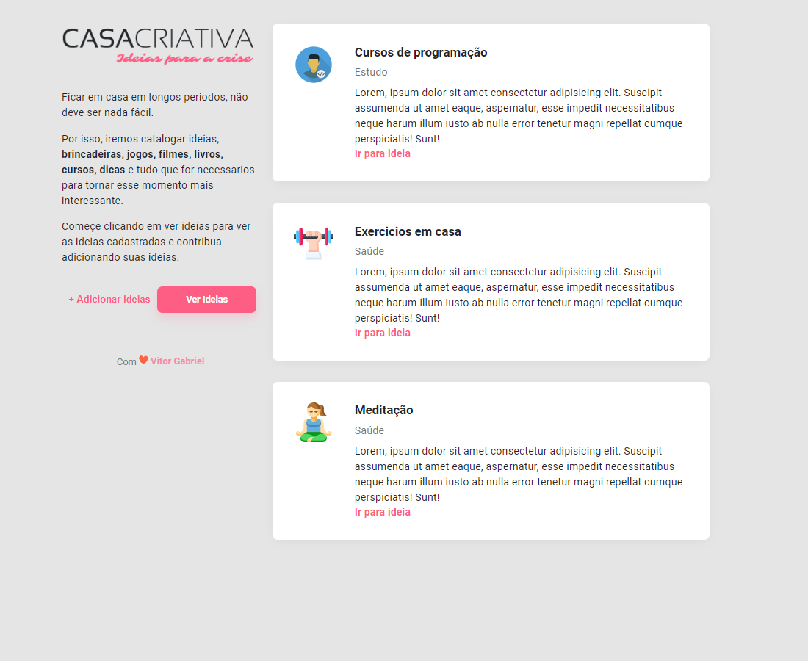
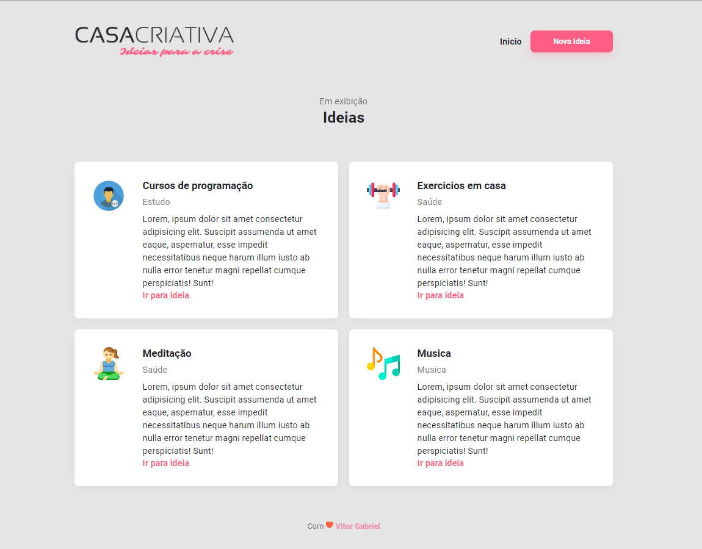

# WorkshopDev Rockeseat

<h1 align="center">
    
    
    
</h1>

  
  

  
  
  
  
	
  

  

## 💻 Projeto

Casa Criativa é um projeto que visa ajudar as pessoas a passar seu tempo em casa com ideias criativas de outras pessoas conectadas ao site.

## 🚀 Tecnologias

Esse projeto foi desenvolvido com as seguintes tecnologias:

-   [HTML](https://developer.mozilla.org/pt-BR/docs/Web/HTML)
-   [CSS](https://developer.mozilla.org/pt-BR/docs/Web/CSS)
-   [JavaScript](https://developer.mozilla.org/pt-BR/docs/Web/JavaScript)

## 📝 Licença

Esse projeto está sob a licença MIT. Veja o arquivo [LICENSE](LICENSE.md) para mais detalhes.

---

Vitor G R Rosa 👋 [Entre em contato](https://www.linkedin.com/in/vitor-gabriel-rodrigues-rosa-56a1301a5/)
